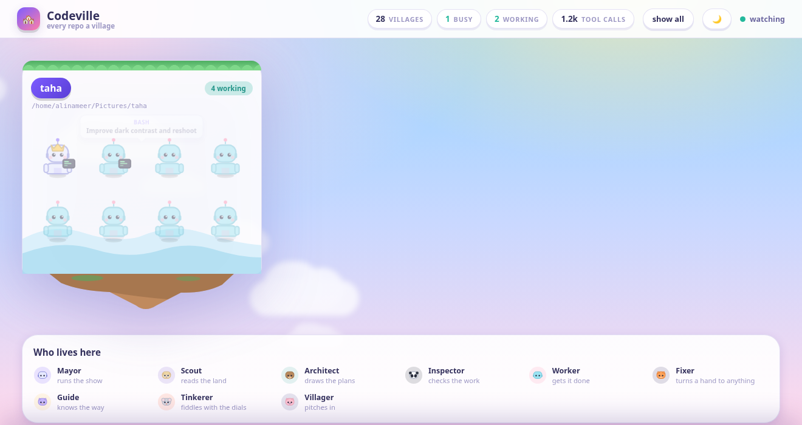
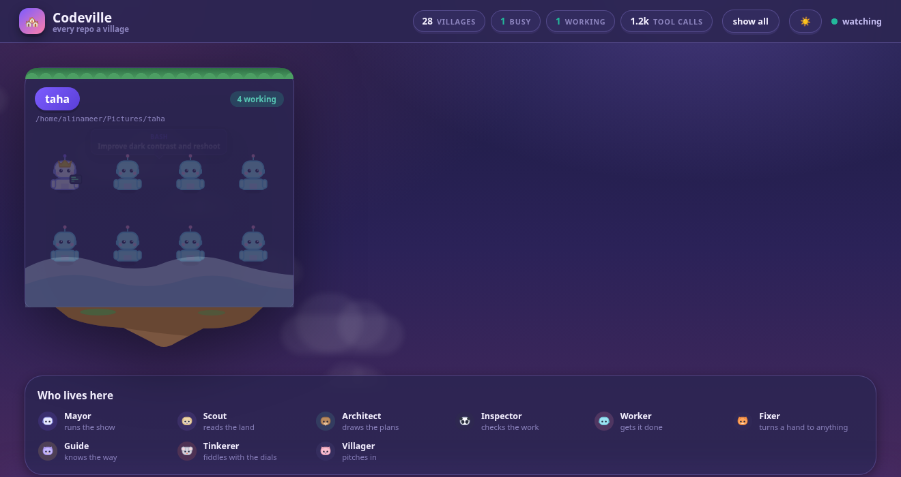

<div align="center">

# 🏘️ Codeville

**Watch Claude Code work, as a village.**

Every repository becomes a floating island. Every agent becomes a villager.
Every tool call becomes something you can actually see them doing.

[](LICENSE)
[](https://www.python.org/)
[](#why-there-are-no-dependencies)
[](#installing)



</div>

---

## What it is

Claude Code tells you what it is doing one line at a time, in one terminal. If you
run it in several repositories, or kick off a workflow that fans out twenty agents,
that view gets thin fast: you know something is happening, but not *what*, *where*,
or *how much is left*.

Codeville reads the transcripts Claude Code already writes to `~/.claude/projects`
and turns them into a live picture:

| In Claude Code | In Codeville |
| --- | --- |
| a project directory | a floating island, with its own biome |
| a session | an expedition on that island |
| the main thread | the **Mayor**, wearing a crown |
| a subagent | a villager, its species chosen by agent type |
| a workflow phase | which part of the island a villager works on |
| a tool call | the prop in their hands, and how they move |
| a tool failure | the villager flinches, the bubble turns red |

It sits in your system tray and tells you, at a glance, how many agents are working
right now — across every repository at once.

<div align="center">


</div>

## Why

Three reasons it exists, in the order they actually mattered:

1. **Several repos at once.** Claude Code keeps one directory per working directory.
   Nothing shows you all of them together, so a long build in one repo and an idle
   session in another look identical from outside.
2. **Fan-out is invisible.** A workflow spawns agents into
   `subagents/workflows/wf_*/`, each with its own transcript, label and phase. That
   is a rich structure with no picture attached to it.
3. **Ambient, not another dashboard.** You should be able to glance at a panel icon
   and know whether to go and make coffee.

## What it shows you

- **Live villagers.** Spawn, work, think, doze, succeed, fail, leave — driven by
  real records, never simulated.
- **What each agent is doing.** A speech bubble carries the tool and a readable
  label: `BASH · Run the test suite`, `EDIT · daemon/world.py`,
  `PLETOR: GENERATE IMAGE · a cat on a bicycle`.
- **Per-tool animation.** The hammer swings for `Edit`, the terminal flickers for
  `Bash`, the lens sweeps for `Grep`, the telescope pans for `WebSearch`.
- **Honest numbers.** Villages, how many are busy, agents working, total tool
  calls. Nothing invented — no XP, no coins, no fake progress bars.
- **Day and night.** Follows your desktop theme, with a manual override.



## Installing

Codeville is Linux-only today, because the tray applet is GTK and AppIndicator.

```bash
git clone https://github.com/Alinameer/codeville.git
cd codeville
./install.sh
```

Then either:

```bash
codeville-tray     # panel applet + native window
codeville          # headless; prints a URL to open in any browser
```

`./install.sh --uninstall` removes everything it created. It never touches your
Claude Code data.

### System packages

The GTK stack cannot be installed with pip, so it has to come from your distro.
Most desktops already have all of it.

| Distro | Command |
| --- | --- |
| Debian / Ubuntu | `sudo apt install python3-gi gir1.2-gtk-3.0 gir1.2-webkit2-4.1 gir1.2-ayatanaappindicator3-0.1` |
| Fedora | `sudo dnf install python3-gobject gtk3 webkit2gtk4.1 libayatana-appindicator-gtk3` |
| Arch | `sudo pacman -S python-gobject gtk3 webkit2gtk-4.1 libayatana-appindicator` |

Without them Codeville still runs — use `codeville` and open the printed URL in a
browser. Only the tray applet and the native window need the packages.

> **GNOME users:** GNOME hides tray icons unless an AppIndicator extension is
> enabled. Ubuntu ships `ubuntu-appindicators` already; elsewhere install
> [AppIndicator Support](https://extensions.gnome.org/extension/615/appindicator-support/).
> `install.sh` checks and warns you.

## Privacy

Your transcripts contain your source code, your prompts and your tool output. So:

- The server binds **127.0.0.1 only**, never `0.0.0.0`.
- Every request needs a **token** generated fresh at each start and written to a
  `0600` file under `$XDG_RUNTIME_DIR/codeville/`. A port on loopback is not an
  authorization boundary — any local process can connect to one.
- Tokens are compared with `hmac.compare_digest`.
- WebSocket upgrades are **rejected cross-origin**, so a page you happen to be
  visiting cannot reach the daemon through your browser.
- Static serving is rooted at `web/` and resolves symlinks before checking
  containment, so `../` and symlink escapes cannot read arbitrary files.
- Codeville **only ever reads**. It never writes to `~/.claude`, and nothing is
  sent anywhere.

Only short labels are surfaced — a tool name and a one-line description. Command
bodies, file contents and tool results are never rendered.

## How it works

```
~/.claude/projects/<slug>/
├── <session>.jsonl                    main transcript  ─┐
└── <session>/                                           │
    ├── subagents/                                       │  tailed
    │   ├── agent-<id>.jsonl           subagent work     │  incrementally
    │   ├── agent-<id>.meta.json       type, phase       │
    │   └── workflows/wf_<id>/                           │
    │       ├── journal.jsonl          start / result   ─┘
    │       └── agent-<id>.jsonl
    └── workflows/wf_<id>.json         phases, status
                    │
                    ▼
   watcher ──► world ──► events ──► WebSocket ──► the village
```

A few decisions worth knowing about, because they are not obvious:

**Polling, not inotify.** The session tree grows a directory per session, per
workflow and per agent. inotify watches are a shared, exhaustible resource that
editors already consume, and silently hitting the ceiling would drop events with no
error. A full `os.stat` sweep of 28 projects takes single-digit milliseconds — well
under the poll interval. Predictable beats clever.

**Transcripts are opened at the end.** The largest transcript on the author's
machine is **137 MB**. Replaying it would stall the view and say nothing about
*now*, so tails start near EOF and read only a recent window — measured at **under
a millisecond** for that 137 MB file.

**Project slugs cannot be reversed.** Claude Code flattens a path into a directory
name, and `/`, `.` and `_` all collapse to `-`:

```
/home/ali/Project/rama.framer.media-178  →  -home-ali-Project-rama-framer-media-178
/home/ali/Pictures/Beeb-all              →  -home-ali-Pictures-Beeb-all
```

Given `-home-ali-Pictures-Beeb-all` there is no way to tell `Beeb-all` from
`Beeb/all`. So Codeville reads `cwd` out of the transcript, which is ground truth,
and only falls back to probing the filesystem for projects whose transcripts are
gone. On the author's machine that resolves **25 of 28** projects exactly; the other
three no longer exist on disk.

**Silence is not an ending.** Nothing in a transcript distinguishes "Claude is
thinking" from "the user walked away". Villagers doze after 45 seconds of quiet and
are only retired after 15 minutes, rather than vanishing the moment writes stop.

## Why there are no dependencies

Codeville installs nothing. No pip, no npm, no build step, no virtualenv.

The daemon is Python standard library only — including a hand-rolled slice of
[RFC 6455](https://datatracker.ietf.org/doc/html/rfc6455) for the WebSocket layer.
The UI is plain ES modules and CSS served straight from `web/`. The GTK stack is
the one exception, and it could never have been a pip dependency anyway.

The cast is hand-authored inline SVG. Every body part is its own `<g>` with a
stable class, so an arm, a head and a held prop animate independently. It stays
crisp at any zoom, re-themes instantly, and costs a few hundred bytes rather than a
sprite sheet.

## Development

```bash
python3 -m unittest discover -s daemon/tests -v   # 150 tests, no test deps either
cd daemon && python3 -m codeville --once          # one scan, print a summary
cd daemon && python3 -m codeville --print-url     # run in the foreground
```

```
codeville/
├── bin/                    launchers (strip snap env vars, then exec)
├── daemon/codeville/
│   ├── wsproto.py          RFC 6455 on the standard library
│   ├── tailer.py           incremental JSONL tailing
│   ├── projects.py         slug → real path, the lossy part
│   ├── records.py          reading meaning out of a record
│   ├── world.py            villages, sessions, villagers, events
│   ├── watcher.py          discovery + polling
│   ├── server.py           HTTP + WebSocket, and the security rules
│   └── app.py              wiring and the single-instance lock
├── shell/codeville_tray.py GTK tray applet + WebKit window
├── web/                    the village (no build step)
└── packaging/              .desktop, icon, systemd user unit
```

### A note for contributors on snaps

If your terminal runs inside a snap (the VS Code snap, for instance) it exports an
`LD_LIBRARY_PATH` and `GTK_PATH` pointing into the snap, and the system `python3`
then dies with `undefined symbol: __libc_pthread_init`. `bin/codeville-tray` strips
those variables before exec'ing. Launch the tray through it, not by calling
`python3 shell/codeville_tray.py` directly.

## Roadmap

- [ ] Optional Claude Code hooks for frame-accurate events, alongside file watching
- [ ] A focused single-village view with per-phase zones
- [ ] Session history — replay an afternoon as a time-lapse
- [ ] Wayland-native tray via the StatusNotifierItem spec
- [ ] macOS menu-bar port

Issues and pull requests welcome.

## Licence

[MIT](LICENSE) © Ali Nameer

<div align="center">
<sub>Codeville is not affiliated with Anthropic. It reads files Claude Code writes; nothing more.</sub>
</div>
